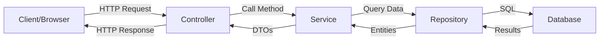
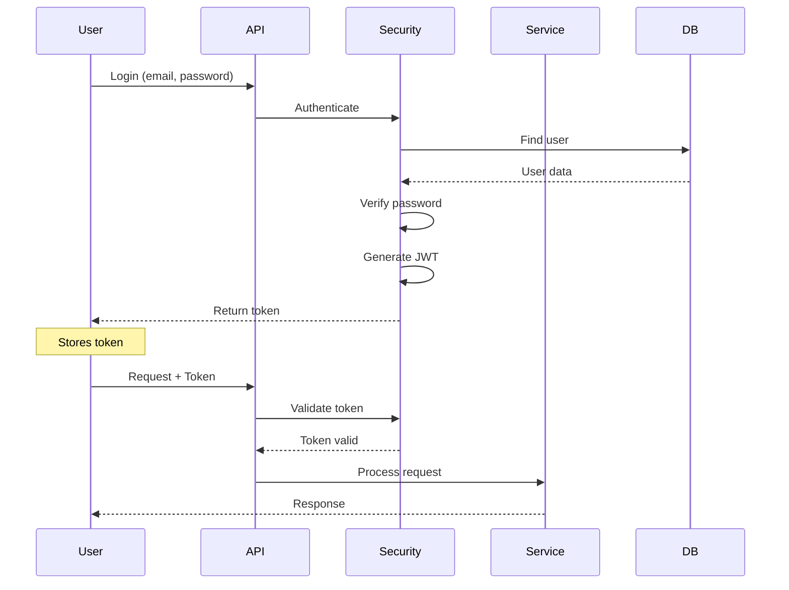

# 🏗️ Architecture Guide

> Understanding how Spring Boot applications are structured

## 📋 Table of Contents

- [What is Architecture?](#what-is-architecture)
- [Layered Architecture](#layered-architecture)
- [Component Interaction](#component-interaction)
- [Data Flow](#data-flow)
- [Design Patterns](#design-patterns)

---

## 🤔 What is Architecture?

**Simple Explanation:**
Architecture is like a blueprint for a building. It shows how different parts of your application connect and work together.

**Why It Matters:**
- Makes code organized and easy to find
- Multiple developers can work without conflicts
- Easy to test and maintain
- Can replace parts without breaking everything

---

## 🏛️ Layered Architecture

All projects in this repository follow a **layered architecture**. Think of it like a cake with different layers, each with a specific job.

### The Layers

```
┌─────────────────────────────────────────┐
│         PRESENTATION LAYER              │  ← What users see/interact with
│         (Controllers)                   │
├─────────────────────────────────────────┤
│         BUSINESS LAYER                  │  ← Where logic happens
│         (Services)                      │
├─────────────────────────────────────────┤
│         PERSISTENCE LAYER               │  ← Talks to database
│         (Repositories)                  │
├─────────────────────────────────────────┤
│         DATABASE LAYER                  │  ← Stores data
│         (MySQL/H2)                      │
└─────────────────────────────────────────┘
```

### Real-World Analogy

Think of a restaurant:

```
┌─────────────────────────────────────────┐
│  WAITER (Controller)                    │  ← Takes orders, serves food
│  - Takes customer requests              │
│  - Delivers responses                   │
└─────────────────────────────────────────┘
           ↓ ↑
┌─────────────────────────────────────────┐
│  CHEF (Service)                         │  ← Prepares the food
│  - Validates orders                     │
│  - Applies business rules               │
│  - Coordinates preparation              │
└─────────────────────────────────────────┘
           ↓ ↑
┌─────────────────────────────────────────┐
│  PANTRY MANAGER (Repository)            │  ← Gets ingredients
│  - Fetches ingredients                  │
│  - Stores leftovers                     │
└─────────────────────────────────────────┘
           ↓ ↑
┌─────────────────────────────────────────┐
│  PANTRY (Database)                      │  ← Stores ingredients
│  - Stores all ingredients               │
└─────────────────────────────────────────┘
```

---

## 🔄 Component Interaction

### How Components Talk to Each Other



### Example: Getting a Product

Let's trace what happens when you request a product:

```
1. USER ACTION
   └─> User clicks "View Product #123"

2. HTTP REQUEST
   └─> GET /api/products/123
   
3. CONTROLLER (ProductController.java)
   └─> @GetMapping("/{id}")
   └─> Receives request
   └─> Calls: productService.getProductById(123)
   
4. SERVICE (ProductService.java)
   └─> Validates: Does product exist?
   └─> Calls: productRepository.findById(123)
   
5. REPOSITORY (ProductRepository.java)
   └─> Extends JpaRepository
   └─> Executes: SELECT * FROM products WHERE id = 123
   
6. DATABASE
   └─> Returns product data
   
7. BACK UP THE CHAIN
   └─> Repository → Service → Controller
   └─> Each layer transforms data
   
8. HTTP RESPONSE
   └─> JSON sent back to user
   └─> User sees product details
```

---

## 📊 Data Flow

### Request-Response Cycle

```
┌──────────────────────────────────────────────────────────┐
│                    CLIENT REQUEST                        │
│  POST /api/products                                      │
│  { "title": "iPhone", "price": 999 }                    │
└────────────────────┬─────────────────────────────────────┘
                     │
                     ▼
┌──────────────────────────────────────────────────────────┐
│                    CONTROLLER                            │
│  - Receives HTTP request                                 │
│  - Validates input format                                │
│  - Converts JSON to ProductDto                           │
└────────────────────┬─────────────────────────────────────┘
                     │
                     ▼
┌──────────────────────────────────────────────────────────┐
│                    SERVICE                               │
│  - Validates business rules                              │
│    • Is price positive?                                  │
│    • Is title unique?                                    │
│  - Converts ProductDto to Product entity                 │
│  - Adds metadata (created date, etc.)                    │
└────────────────────┬─────────────────────────────────────┘
                     │
                     ▼
┌──────────────────────────────────────────────────────────┐
│                    REPOSITORY                            │
│  - Generates SQL: INSERT INTO products...                │
│  - Executes query                                        │
└────────────────────┬─────────────────────────────────────┘
                     │
                     ▼
┌──────────────────────────────────────────────────────────┐
│                    DATABASE                              │
│  - Stores product                                        │
│  - Returns generated ID                                  │
└────────────────────┬─────────────────────────────────────┘
                     │
                     ▼
┌──────────────────────────────────────────────────────────┐
│                    RESPONSE BACK UP                      │
│  Database → Repository → Service → Controller            │
│  Each layer adds/transforms data                         │
└────────────────────┬─────────────────────────────────────┘
                     │
                     ▼
┌──────────────────────────────────────────────────────────┐
│                    CLIENT RESPONSE                       │
│  201 Created                                             │
│  { "id": 123, "title": "iPhone", "price": 999 }         │
└──────────────────────────────────────────────────────────┘
```

---

## 🎨 Design Patterns

### 1. MVC Pattern (Model-View-Controller)

```
┌─────────────┐
│    VIEW     │  ← Frontend (React/Angular)
│  (Client)   │
└──────┬──────┘
       │
       ▼
┌─────────────┐
│ CONTROLLER  │  ← REST Controllers
│  (API)      │
└──────┬──────┘
       │
       ▼
┌─────────────┐
│    MODEL    │  ← Entities & Services
│  (Business) │
└─────────────┘
```

**Used in:** All projects

**Why:** Separates concerns - UI, logic, and data are independent

---

### 2. Repository Pattern

```
┌─────────────────────────────────┐
│         Service Layer           │
│  "I need all active products"   │
└────────────┬────────────────────┘
             │
             ▼
┌─────────────────────────────────┐
│      Repository Interface       │
│  findAllByLiveTrue()            │
└────────────┬────────────────────┘
             │
             ▼
┌─────────────────────────────────┐
│      JPA Implementation         │
│  Generates SQL automatically    │
└────────────┬────────────────────┘
             │
             ▼
┌─────────────────────────────────┐
│          Database               │
└─────────────────────────────────┘
```

**Used in:** All projects with databases

**Why:** Abstracts database operations, easy to test and swap databases

---

### 3. DTO Pattern (Data Transfer Object)

```
DATABASE                SERVICE                 API
┌─────────┐            ┌─────────┐            ┌─────────┐
│ Product │            │ Product │            │ Product │
│ Entity  │───────────▶│ DTO     │───────────▶│ JSON    │
├─────────┤            ├─────────┤            ├─────────┤
│ id      │            │ id      │            │ id      │
│ title   │            │ title   │            │ title   │
│ price   │            │ price   │            │ price   │
│ password│            │         │  ← Hidden  │         │
│ internal│            │         │  ← Hidden  │         │
└─────────┘            └─────────┘            └─────────┘
```

**Used in:** Electronic Store, Auth Samples

**Why:** 
- Hide sensitive data (passwords, internal IDs)
- Send only what's needed
- Decouple API from database structure

---

### 4. Dependency Injection

```java
// BAD: Creating dependencies manually
public class ProductService {
    private ProductRepository repo = new ProductRepository();
    // Tightly coupled, hard to test
}

// GOOD: Spring injects dependencies
@Service
public class ProductService {
    private final ProductRepository repo;
    
    @Autowired  // Spring provides this
    public ProductService(ProductRepository repo) {
        this.repo = repo;
    }
    // Loosely coupled, easy to test
}
```

**Used in:** All projects

**Why:**
- Easy to test (can inject mock objects)
- Flexible (can swap implementations)
- Spring manages object lifecycle

---

## 🔐 Security Architecture

### Authentication Flow



### Security Layers

```
┌─────────────────────────────────────┐
│  1. HTTPS/TLS                       │  ← Encrypted communication
├─────────────────────────────────────┤
│  2. JWT Token Validation            │  ← Is user authenticated?
├─────────────────────────────────────┤
│  3. Role-Based Access Control       │  ← Does user have permission?
├─────────────────────────────────────┤
│  4. Input Validation                │  ← Is data safe?
├─────────────────────────────────────┤
│  5. SQL Injection Prevention        │  ← JPA protects against this
├─────────────────────────────────────┤
│  6. Password Encryption             │  ← BCrypt hashing
└─────────────────────────────────────┘
```

---

## 📦 Package Structure

### Standard Organization

```
com.sample.electronicstore/
│
├── controller/          ← REST endpoints
│   ├── UserController.java
│   ├── ProductController.java
│   └── CartController.java
│
├── service/            ← Business logic
│   ├── UserService.java
│   ├── ProductService.java
│   └── CartService.java
│
├── repository/         ← Database access
│   ├── UserRepository.java
│   ├── ProductRepository.java
│   └── CartRepository.java
│
├── entity/            ← Database tables
│   ├── User.java
│   ├── Product.java
│   └── Cart.java
│
├── dto/               ← API models
│   ├── UserDto.java
│   ├── ProductDto.java
│   └── CartDto.java
│
├── config/            ← Configuration
│   ├── SecurityConfig.java
│   └── JwtConfig.java
│
├── exception/         ← Error handling
│   ├── GlobalExceptionHandler.java
│   └── ResourceNotFoundException.java
│
└── util/              ← Helper classes
    ├── JwtUtil.java
    └── FileUtil.java
```

---

## 🎯 Best Practices

### 1. Single Responsibility Principle

Each class should do ONE thing well.

```
✅ GOOD
- UserController: Handle user HTTP requests
- UserService: User business logic
- UserRepository: User database operations

❌ BAD
- UserManager: Does everything (HTTP, logic, database)
```

### 2. Dependency Direction

Always depend on abstractions, not concrete classes.

```
Controller → Service Interface → Service Implementation
                ↓
         Repository Interface → Repository Implementation
```

### 3. Error Handling

Centralized exception handling.

```
Exception occurs → GlobalExceptionHandler → Formatted error response
```

---

## 📈 Scalability Considerations

### Horizontal Scaling

```
         ┌──────────────┐
         │ Load Balancer│
         └───────┬──────┘
                 │
        ┌────────┼────────┐
        │        │        │
    ┌───▼──┐ ┌──▼───┐ ┌──▼───┐
    │App 1 │ │App 2 │ │App 3 │  ← Multiple instances
    └───┬──┘ └──┬───┘ └──┬───┘
        │       │        │
        └───────┼────────┘
                │
         ┌──────▼──────┐
         │  Database   │
         └─────────────┘
```

**Why JWT is good for this:**
- Stateless (no session storage needed)
- Each instance can validate tokens independently

---

## 🧪 Testing Architecture

```
┌─────────────────────────────────┐
│     Integration Tests           │  ← Test full flow
├─────────────────────────────────┤
│     Service Tests               │  ← Test business logic
├─────────────────────────────────┤
│     Repository Tests            │  ← Test database queries
└─────────────────────────────────┘
```

---

## 💡 Key Takeaways

1. **Layered Architecture** = Organized, maintainable code
2. **Each layer has a job** = Easy to find and fix issues
3. **Loose coupling** = Can change one part without breaking others
4. **Design patterns** = Proven solutions to common problems
5. **Security in layers** = Multiple defenses
6. **Standard structure** = Easy for teams to collaborate

---

## 📚 Further Reading

- [Spring Boot Architecture](https://spring.io/guides/gs/spring-boot/)
- [Clean Architecture](https://blog.cleancoder.com/uncle-bob/2012/08/13/the-clean-architecture.html)
- [Design Patterns](https://refactoring.guru/design-patterns)
- [REST API Design](https://restfulapi.net/)

---

**Remember:** Good architecture makes your code easy to understand, test, and maintain!

*Last Updated: 2025*
