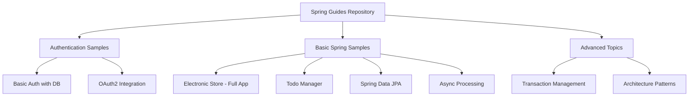
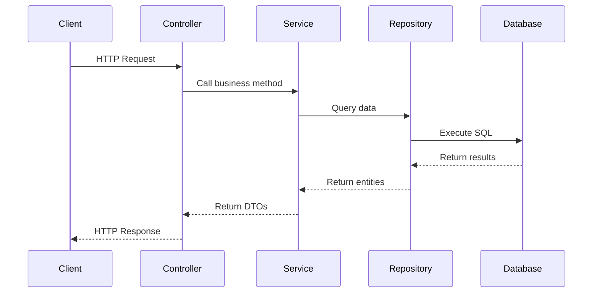

# 🌱 Spring Framework Learning Repository

> A comprehensive collection of Spring Boot projects demonstrating modern Java application development patterns and best practices.

[](https://spring.io/projects/spring-boot)
[](https://www.oracle.com/java/)
[](LICENSE)

## 📋 Table of Contents

- [Overview](#overview)
- [📚 Documentation](#-documentation)
- [Project Structure](#project-structure)
- [Key Projects](#key-projects)
- [Getting Started](#getting-started)
- [Technologies Used](#technologies-used)
- [Architecture Patterns](#architecture-patterns)
- [Contributing](#contributing)

---

## 📚 Documentation

**New to this repository? Start here:**

- 🚀 **[Quick Start Guide](./QUICKSTART.md)** - Get running in 5 minutes
- 📊 **[Project Comparison](./PROJECT_COMPARISON.md)** - Choose the right project for you
- 🏗️ **[Architecture Guide](./ARCHITECTURE.md)** - Understand how it all works
- 🎨 **[Visual Diagrams](./DIAGRAMS.md)** - See how components connect
- 📚 **[Documentation Index](./DOCUMENTATION_INDEX.md)** - Navigate all documentation

---

## 🎯 Overview

This repository contains hands-on implementations of Spring Framework concepts, ranging from basic to advanced topics. Each project is self-contained and demonstrates specific Spring Boot features, making it easy to learn and reference.

**What You'll Learn:**
- Building RESTful APIs with Spring Boot
- Database operations with Spring Data JPA
- Security implementation with Spring Security
- Asynchronous processing
- Transaction management
- Authentication & Authorization
- Full-stack application development

---

## 📁 Project Structure

```
spring-guides/
├── authSamples/              # Authentication & Security demos
├── springBasicSamples/       # Core Spring Boot concepts
├── spring-transaction-sample/ # Transaction management
├── demo-from-app-architecture/ # Application architecture patterns
└── uploads/                  # File storage examples
```

### Visual Overview



---

## 🚀 Key Projects

### 1. **Electronic Store Backend** 🛒
A complete e-commerce backend application demonstrating enterprise-level features.

**Features:**
- User management with role-based access
- Product catalog with categories
- Shopping cart functionality
- Order processing
- Image upload handling
- JWT authentication
- API documentation with Swagger

**Tech Stack:** Spring Boot, Spring Security, MySQL, JWT, Docker

[📖 View Detailed Documentation](springBasicSamples/electronicStorePorject/Application-documentation.md)

---

### 2. **Todo Manager** ✅
A simple yet comprehensive task management API.

**Features:**
- Create, read, update, delete tasks
- Mark tasks as complete/pending
- Filter by status
- RESTful API design

**Perfect for:** Understanding CRUD operations and REST principles

[📖 View Documentation](./springBasicSamples/todo-manager/ToDoApplicationFRD.md)

---

### 3. **Authentication Samples** 🔐
Multiple authentication implementations showing different security approaches.

**Includes:**
- Database-backed authentication
- Password encryption with BCrypt
- OAuth2 integration (GitHub)
- JWT token-based auth

**Learn:** How to secure your Spring applications

---

### 4. **Spring Data JPA Demo** 💾
Database operations with custom error handling.

**Features:**
- JPA repository patterns
- Custom error code mapping
- Duplicate record handling
- Database constraint management

**Learn:** Professional database interaction patterns

---

### 5. **Async Processing Demo** ⚡
Demonstrates asynchronous task execution in Spring.

**Learn:** How to improve application performance with async operations

---

### 6. **Transaction Management** 🔄
Shows how to handle database transactions properly.

**Learn:** ACID properties and transaction boundaries in Spring

---

## 🏃 Getting Started

### Prerequisites

- **Java 21** or higher
- **Maven 3.6+**
- **MySQL 8.0+** (for database projects)
- **Docker** (optional, for containerized setup)
- **Git**

### Quick Start

1. **Clone the repository**
   ```bash
   git clone <repository-url>
   cd spring-guides
   ```

2. **Choose a project**
   ```bash
   cd springBasicSamples/todo-manager
   ```

3. **Run the application**
   ```bash
   ./mvnw spring-boot:run
   ```

4. **Access the application**
   - Most apps run on: `http://localhost:8080`
   - Swagger UI (if available): `http://localhost:8080/swagger-ui.html`

### Docker Setup (Electronic Store)

```bash
cd springBasicSamples/electronicStorePorject/electronic-store-backend
docker-compose up -d
./mvnw spring-boot:run
```

---

## 🛠 Technologies Used

| Technology | Purpose | Projects Using It |
|------------|---------|-------------------|
| **Spring Boot 3.5.6** | Application framework | All projects |
| **Spring Data JPA** | Database operations | Most projects |
| **Spring Security** | Authentication & Authorization | Auth samples, Electronic Store |
| **MySQL** | Relational database | Electronic Store, Auth samples |
| **H2 Database** | In-memory testing | Auth samples |
| **JWT** | Token-based auth | Electronic Store |
| **Lombok** | Reduce boilerplate | Most projects |
| **MapStruct** | Object mapping | Electronic Store |
| **Swagger/OpenAPI** | API documentation | Electronic Store |
| **Docker** | Containerization | Electronic Store |

---

## 🏗 Architecture Patterns

### Layered Architecture

All projects follow a clean layered architecture:

```
┌─────────────────────────────────┐
│     Controller Layer            │  ← REST endpoints
├─────────────────────────────────┤
│     Service Layer               │  ← Business logic
├─────────────────────────────────┤
│     Repository Layer            │  ← Data access
├─────────────────────────────────┤
│     Database                    │  ← Persistence
└─────────────────────────────────┘
```

### Request Flow Example



---

## 📚 Learning Path

**Recommended order for beginners:**

1. **Start Here:** `todo-manager` - Learn basic CRUD operations
2. **Next:** `spring-data-jpa-demo` - Understand database interactions
3. **Then:** `async-demo` - Learn async processing
4. **Security:** `authSamples` - Implement authentication
5. **Advanced:** `electronic-store-backend` - Full application
6. **Expert:** `spring-transaction-sample` - Transaction management

---

## 🔑 Key Concepts Demonstrated

### RESTful API Design
- Proper HTTP methods (GET, POST, PUT, DELETE)
- Status codes (200, 201, 400, 404, 500)
- Request/Response patterns
- Error handling

### Security
- Password encryption
- JWT tokens
- Role-based access control
- OAuth2 integration

### Database Management
- JPA entities and relationships
- Custom queries
- Transaction management
- Error handling

### Best Practices
- DTO pattern for data transfer
- Service layer for business logic
- Exception handling
- Input validation
- API documentation

---

## 🤝 Contributing

Contributions are welcome! Please feel free to submit a Pull Request.

1. Fork the repository
2. Create your feature branch (`git checkout -b feature/AmazingFeature`)
3. Commit your changes (`git commit -m 'Add some AmazingFeature'`)
4. Push to the branch (`git push origin feature/AmazingFeature`)
5. Open a Pull Request

---

## 📞 Support

If you have questions or need help:
- Open an issue in this repository
- Check existing documentation in each project folder
- Review the code comments

---

## 📝 License

This project is licensed under the MIT License - see the LICENSE file for details.

---

## 🎓 Additional Resources

- [Spring Boot Official Documentation](https://spring.io/projects/spring-boot)
- [Spring Security Reference](https://spring.io/projects/spring-security)
- [Spring Data JPA Guide](https://spring.io/projects/spring-data-jpa)
- [RESTful API Design Best Practices](https://restfulapi.net/)

---

**Happy Learning! 🚀**

*Last Updated: 2025*
